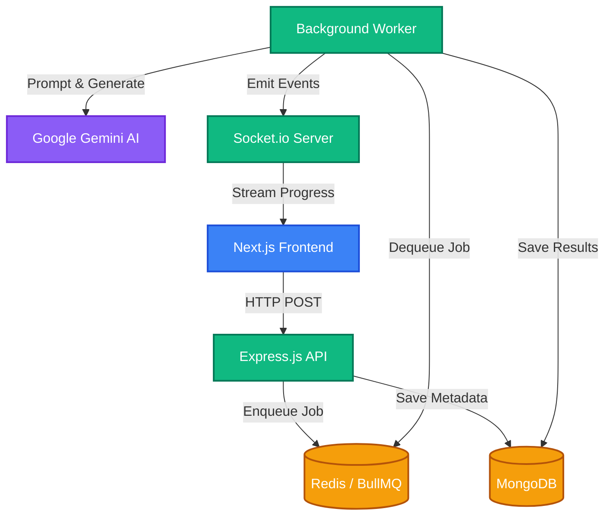

# VedaAI Assessment Creator

A premium, full-stack AI-native web application for creating, managing, and exporting beautifully formatted academic assessments. Powered by a Next.js frontend and a Node.js/Express backend with Google's Gemini AI.

## Architecture Overview & Approach

VedaAI is designed for high reliability, scalability, and a premium user experience. Generating AI content can take time and often causes HTTP timeouts in traditional synchronous architectures. To solve this, VedaAI implements a **robust asynchronous queue-based architecture**:

1. **Frontend Request:** The user submits their assessment requirements (Class, Subject, Time, Question Types, Instructions) via a highly polished, Framer Motion-animated React interface.
2. **Database Storage:** The Express backend receives the request and stores the initial assignment metadata in **MongoDB**.
3. **Queue Ingestion:** Instead of waiting for the AI response, the backend creates an asynchronous job and pushes it onto a **Redis** queue managed by **BullMQ**. It immediately returns a `jobId` to the frontend.
4. **Background Processing:** A dedicated BullMQ Worker picks up the job from Redis and begins communicating with the **Google Gemini API** to generate the complex, formatted assessment content.
5. **Real-time Streaming:** As the worker processes the job, it broadcasts real-time progress updates (e.g., "Queued", "Processing", "Completed") back to the specific client using **Socket.io**.
6. **Premium UX Response:** The frontend listens to these Socket.io events, displaying smooth status transitions and updating the progress bar natively without polling.
7. **Final Rendering:** Once generated, the data is saved, and the frontend dynamically renders a beautifully formatted, printable examination paper with a generated Answer Key.

### Architecture Diagram



### Key Architectural Decisions:
- **Asynchronous Queues:** Prevents Vercel/Render serverless timeouts during long LLM generations.
- **WebSocket Feedback:** Eliminates heavy HTTP polling and provides a native, app-like feel.
- **Fluid Motion Design:** Heavy use of `framer-motion` ensures that loading states, page transitions, and data rendering feel like a premium SaaS product rather than a basic utility.

---

## Tech Stack

### Backend (API, Queues & AI)
- **Runtime:** Node.js with TypeScript
- **Framework:** Express.js
- **Database:** MongoDB (Mongoose)
- **Cache & Queue Backend:** Redis (Upstash / ioredis)
- **Job Processing:** BullMQ
- **Real-time Comm:** Socket.io
- **AI Integration:** Google Generative AI (Gemini Flash)

### Frontend (UI/UX)
- **Framework:** Next.js 16 (App Router)
- **Language:** TypeScript + React 19
- **Styling:** Tailwind CSS
- **Motion & Interactions:** Framer Motion
- **UI Components:** shadcn/ui + Radix UI
- **Forms & Validation:** React Hook Form + Zod
- **State Management:** Zustand
- **PDF Generation:** @react-pdf/renderer
- **Notifications:** Sonner

---

## Project Structure

```
vedaai-assessment-creator/
├── backend/          # Node.js + Express API server
│   ├── src/
│   │   ├── config/   # MongoDB and Redis configs
│   │   ├── controllers/  # Express route handlers
│   │   ├── models/   # Mongoose schemas
│   │   ├── routes/   # API routing definitions
│   │   ├── services/ # Gemini API & core business logic
│   │   ├── sockets/  # Socket.io event emitters
│   │   ├── queues/   # BullMQ queue definitions
│   │   ├── workers/  # BullMQ background job processors
│   │   └── index.ts  # Express server entry point
│   └── package.json
│
├── frontend/         # Next.js React application
│   ├── app/          # Next.js App Router (Pages & Layouts)
│   ├── components/   # Reusable UI components & Layouts
│   ├── lib/          # API helpers and utility functions
│   ├── store/        # Zustand global state stores
│   └── package.json
```

---

## Prerequisites

- Node.js 18+
- npm or yarn
- MongoDB Database (Local or MongoDB Atlas)
- Redis Instance (Local or Upstash)
- Google Gemini API Key

---

## Getting Started

### 1. Clone the repository
```bash
git clone <repository-url>
cd vedaai-assessment-creator
```

### 2. Setup Environment Variables

#### Backend Setup
```bash
cd backend
cp .env.example .env
```
Edit `backend/.env` and configure:
- `PORT` - (default: 5000)
- `MONGODB_URI` - MongoDB connection string
- `REDIS_URL` - Complete Redis connection URL (e.g., from Upstash)
- `GEMINI_API_KEY` - Your Google Gemini Key
- `CLIENT_URL` - Your frontend URL (e.g. `http://localhost:3000`)

#### Frontend Setup
```bash
cd ../frontend
cp .env.example .env.local
```
Edit `frontend/.env.local`:
- `NEXT_PUBLIC_API_URL` - Your backend URL (e.g. `http://localhost:5000`)

### 3. Install Dependencies

**Backend:**
```bash
cd backend
npm install
```

**Frontend:**
```bash
cd ../frontend
npm install
```

### 4. Run Development Servers

**Run the Backend (Terminal 1):**
```bash
cd backend
npm run dev
```

**Run the Frontend (Terminal 2):**
```bash
cd frontend
npm run dev
```

The application will be available at `http://localhost:3000`.

---

## Deployment Readiness

This project is structured for immediate deployment to platforms like Vercel (Frontend) and Render/Railway (Backend):
- **CORS Configured:** Backend strictly accepts origins from the configured `CLIENT_URL`.
- **Environment Agnostic:** All sensitive variables and connection strings are managed via `.env`.
- **Background Jobs:** Ready for serverless deployment limits thanks to isolated BullMQ workers. 

## License

ISC

## Contact

For questions or support, please contact the development team.
